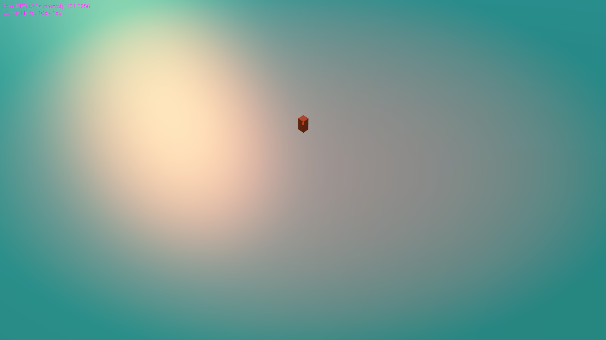
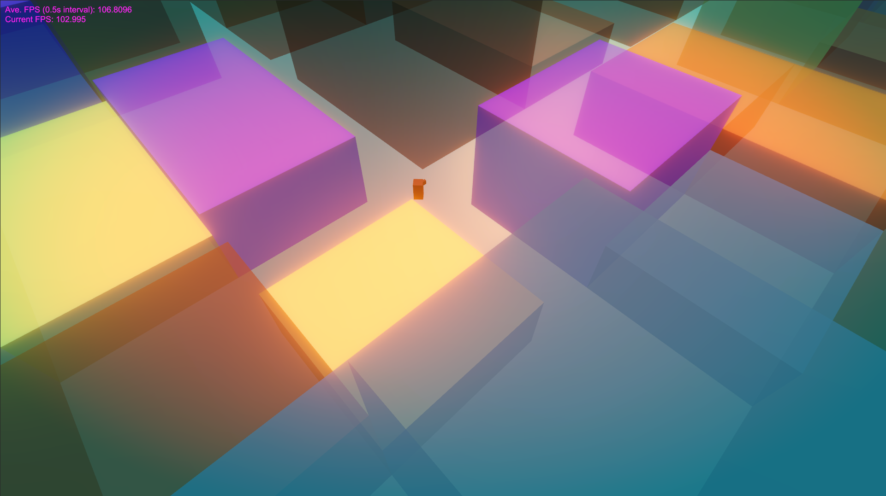
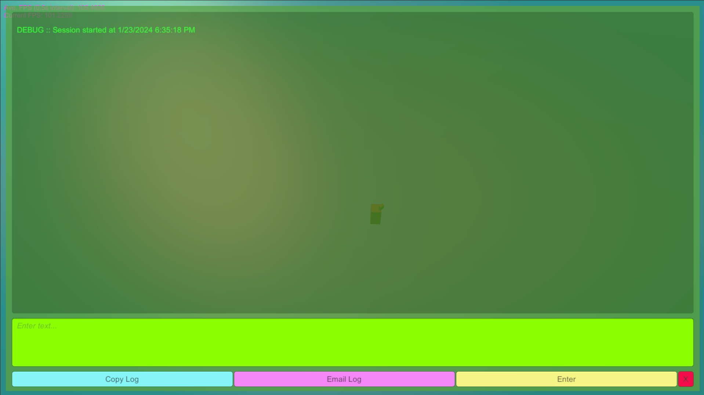
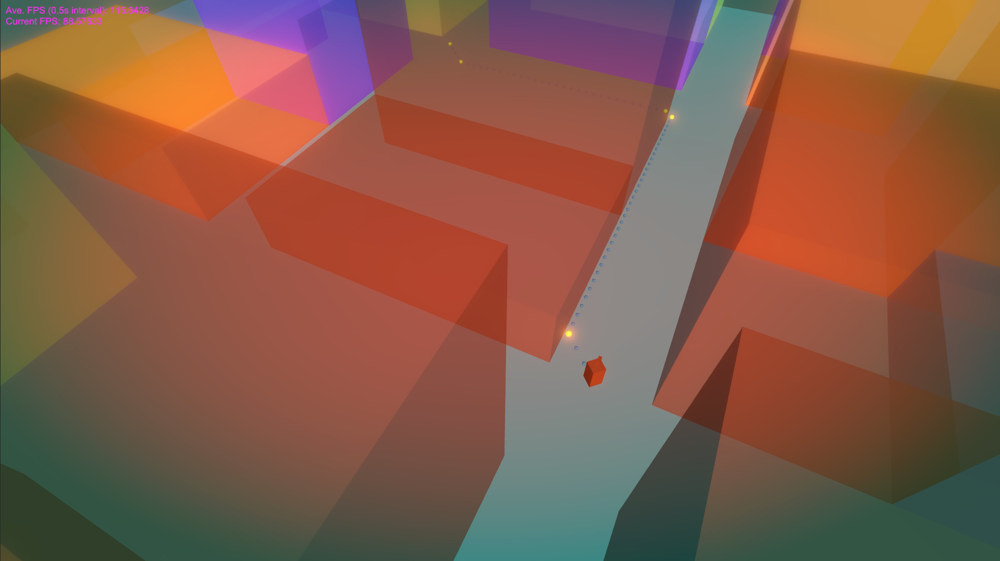
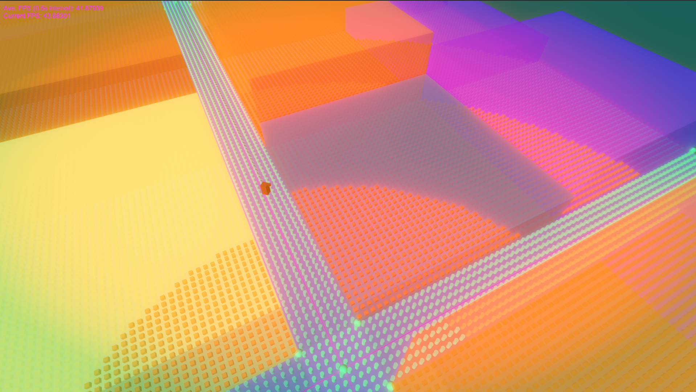

# Unity Pathfinding Exploration with A*

Unity NavMesh will generally be a more efficient solution than this, but since I hadn't done it in Unity before, I decided to implement custom pathfinding in Unity with a canonical implementation of A*. This prototype could be a jumping off point for future exploration of some of the implemented features in future projects in which there might be a need for a more custom solution. It also helps us dissect pathfinding... and of course, it's just fun! I go into some detail below. If you just want to clone or download and play with it, skip ahead to the **Quick Start** section.

As mentioned, I implemented pathfinding via a canonical implementation of A*, with the addition of a weighted nav grid and path pruning with Bresenham's algorithm and collinearity. I implemented Euclidean, Manhattan and Chebyshev distance functions. Selecting Chebyshev, as in this example, will automatically alter the selection of neighbors to include diagonals. 

Bresenham's initially had some defects that I have now fixed. It now works too well, unfortunately: it prunes so many points that the resulting path intersects with obstacles, so I disabled it by default in the main scene. You can re-enable it by opening the THT.Main scene, selecting the THT.Main.Logic.Root object in the scene heirarchy and checking the 'Bresenham Pruning' box on the THT Main Scene script in the inspector. I recommend having one or the other active at a time, but both can be checked simultaneously. This could be ameliorated to some extent by checking for corners on obstacles, and would be less of an issue in more open environments with organic shapes like rocks. It however solves another common issue with A*, which is wall-hugging. One could perhaps a imagine a hybrid solution with raycasting or some other means of testing corners to add waypoints around corners, and a maybe even a dynamic system that optimizes based on the environment. 

The collinearity algorithm is working quite well in the environment of this project, as it tends to preserve points on corners, so it never produces paths that intersect with the environment. I should mentioned that I adapted both the Bresenham's and collinearity implementations from a python implementation in course assignments materials from an online course I took in 2018, the [Flying Car Nanodegree from Udacity](https://graduation.udacity.com/confirm/Q7CT96Q4). We had the choice to use either pruning method, and I chose to stack both and I remembered being impressed by the fact that calling both resulting in a more parsimonious path than using either alone. The environment for that assignment was much more open, so I didn't notice the clipping issue with obstacles.

The nav grid is generated following, and based on, procedural generation of a street layout and some buildings. Locations where buildings are placed are marked with a special value, Int16.MaxValue, which indicates that they are obstacles. Pathing and smoothing were achieved using a SQUAD spline implementation from a personal code library I maintain for Unity projects. I haven't used SQUAD splines for this purpose before, I've only used them for animation of models through a scene. In the context of pathfinding SQUAD splines work quite well, but they do have a couple of defects that would need to be addressed for a production app. In particular, you'll notice that the character will point in odd directions, particularly at the end of a spline path. On longer paths, it will also do some strange loop-de-loops and overly wide sweeps interpolated around certain corners. I'll probably need to do a deep dive back into my SQUAD implementation at some point to verify it is correct; it may need some bugfix.

I used a few classes imported from the aforementioned personal library, which includes some useful utilities, patterns and other code. Apart from the SQUAD-based spline system above, most of it is boilerplate code for things like UI. The convention I used is that code that I did not author from scratch and is not contained in my assembly retains its own namespace and has a copyright header. Classes fully authored by me for this project start with the namespace domain PFS and are marked with a header indicating that they were authored specifically for this project. All code is fully documented inline with comments and XML doc headers.

Since I have my own source control repository running CentOS 7 and hg at home with incremental backup via rcopy, I used that for source control for this project, so you won't see that history in this project, which is essentially a copy.

## Quick Start

1. Clone or download this project.

2. Open the project via the Unity Hub. The hub should find that it was created with version 2023.2.2f1.

3. Under Assets/Scenes, you'll find a scene called PFS.Init. This project uses a custom sequential scene loader that loads scenes one at a time in a queue to ensure dependencies are not missing in later scenes. All of the main code and assets are in PFS.Main, but PFS.Init is where the project needs to start.

4. The scene will initially appear blank. Everything is accomplished via commands issued from a custom in-game debug console. To launch the debug console, type the backqoute/tilde key on your keyboard. You have to click the scene to give it focus first and sometimes you have to hit the backquote key twice to bring it up the first time. After this, you should be able to toggle the debug console every time you hit the backquote key. The debug console can also be closed with the red 'X' button in its lower right-hand corner and via the command 'exit'.

*The start state.*

5. Type the command 'genst' (which stands for 'generate street scene'). The map will populate with an orthogonal street layout and some buildings. You can type 'undo genst' to remove the most recent layout. If you type 'genst' again, a new layout will be created. Whenever there is no generated content on the stage, the Player script will default to the original behavior that it was coded with. The Player will be re-spawned to the righthand-most, nearest-most intersection and the camera will be re-centered on the player every time you issue the 'genst' command.

> [!NOTE]
> If you don't type 'undo genst' between 'genst' commands, generated street scenes will pile up on top of each other. Sometimes errors might occur with the pathing visualization; you can clear those up by issuing 'undo genst' as well and starting over with a fresh scene.

6. To go somewhere, simply click somewhere on the navigable terrain (the streets). There is code to prevent errors when clicking outside the navigable area, because sometimes a raycast manages to penetrate a building and land somewhere it isn't supposed to. You can visualize the path defined by the pathfinding algorithm with another command described below.

*A generated street scene.*

## The Debug Console

The debug console also has some additional helpful commands:

> **undo [command]**: 

undoes the last command

> **list**: 

lists all commands available

> **[command] help**: 

shows help text for the requested command

> **exit**: 

exits the Debug Console

*The debug console.*

## Camera controls

There are also standard keyboard and mouse camera controls to make it easier to follow the character around the map:

> W,A,S,D and arrow keys

forward, back, left and right

> Q,E

left and right camera rotation

> Mouse scrollwheel/touch pad

zoom in and out

> -,=

tilt down and up

## Visualization Aids

To aid with debugging, since many of the systems coded for this project are not easy to debug simply with break-point debugging, I added visualization aids to the scene that can be turned on and off with a couple of commands:

> **envis** [argument]: 

enables the specified visualization aid

> **disvis** [argument]: 

disables the specified visualization aid

Valid arguments for these commands are:

> **path**: 

displays pathfinding breadcrumbs (small, opaque blue is A*, translucent purple is Bresenham and gold is collinearity)

> **blk**: 

displays widgets defining the 4 corners of each block and the center of each intersection

> **nav**: 

displays the weights on the nav grid (blue cylinders are navigable, red cubes are obstacles)

> [!WARNING]
> If you enable nav visualization, it can take a minute or more to generate the scene depending on your system, because it will be placing 300 x 300 = 90,000 nav markers for every whole integer coordinate on the map!

> **spln**: 

displays the center spline of each street

> **strt**: 

applies a magenta shader color to the streets

*Pathing visualization enabled.*

### **Examples**:

> envis path 

...this will enable the pathfinding breadcrumbs and cause them to appear every time you click the navigable area

> disvis path

...this will turn the pathfinding breadcrumbs off again

> envis nav

...this will turn on the nav grid markers the next time you generate a street scene via the 'genst' command

*Full visualization enabled: a bit crowded!*
